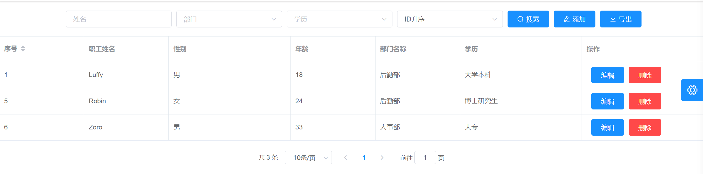
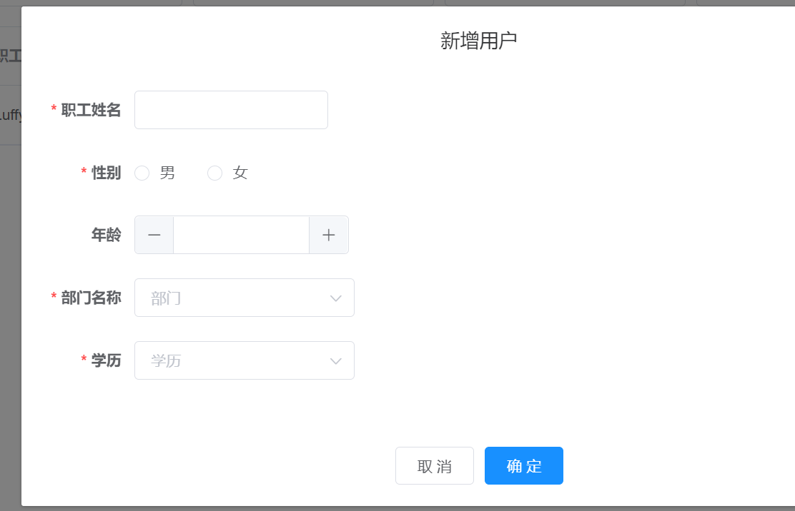

# 1. 项目启动

## 1.1.   部署数据库

启动项目之前，先运行目录中的emp.sql脚本，生成职工表。
表结构生成之后，去后端配置文件中的配置表中配置数据库连接。
在注释处填入数据库用户名以及密码，以及url地址。

application.yml:

```properties
spring:
  mvc:
    pathmatch:
      matching-strategy: ant_path_matcher
  datasource:
  #此处配置数据库用户名，密码，以及数据库地址。
    username: 
    password: 
    url:
    driverClassName: com.mysql.cj.jdbc.Driver
demo:
  jwt:
    # 加密秘钥
    secret: f4e2e52034348f86b67cde581c0f9eb5
    # token有效时长，7天，单位秒
    expire: 604800
    header: token
```

## 1.2.   用户登录

用户前后端启动之后，前端默认跳转到登录页面。http://localhost:9527/#/login

用户登录功能没有单独建表，用户名和密码以配置文件的形式存储在后端。

用户名：amin
密码：111111

用户名密码默认为输入状态。


# 2. 功能验证

## 2.1.    核心功能验证

登录成功之后，跳转到主界面。选择左侧的“职工管理”下的“职工列表”菜单，进入到我开发的功能界面。



姓名，部门，学历均可做筛选，姓名支持模糊查询。
id支持选择升降序排列。
支持分页查询。



用户新增功能前后端均有校验，新增用户之后会触发页面主动刷新。编辑功能同理（用户信息修改没做后端校验）。
学历以及部门都没有单独建表，映射关系直接保存在前端。

用户删除功能有删除确认，确认删除后该条职工信息就会在数据库中删除（物理删）。


## 2.2.    其他功能验证

点击导出按钮确认后，页面上查询出的所有数据都会被导出到excel中。
导出功能写在前端。

swagger功能
登录 http://localhost:8080/swagger-ui.html#/ 可以查看对应的api doc。


# 3. Linux脚本验证

bash目录下的两个脚本，sh01.sh功能为查找文件内容
sh02.sh功能为查看系统内存
